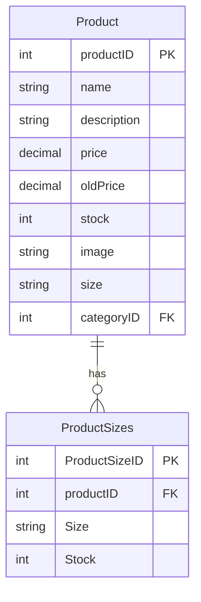
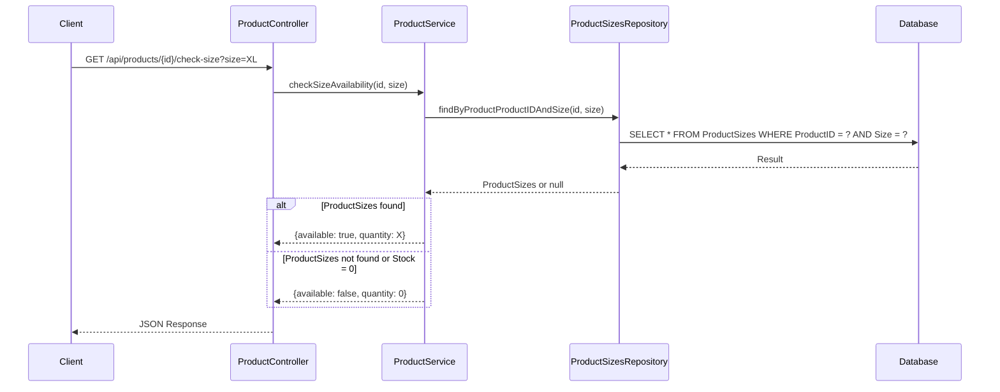
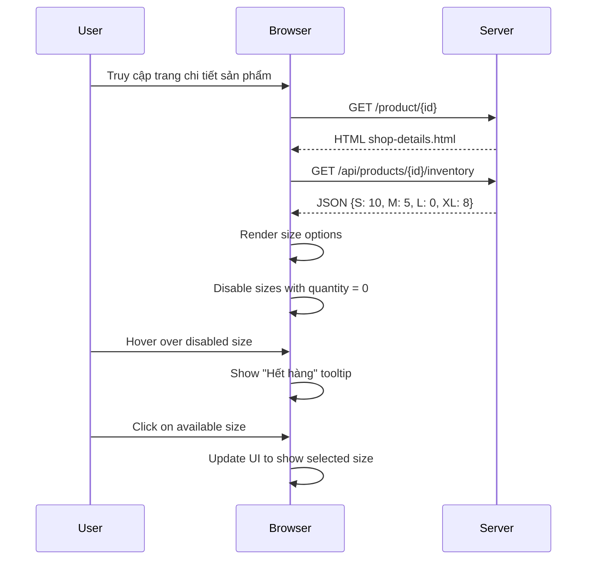

# Tài liệu Thiết kế Kỹ thuật: Kiểm tra Tồn kho theo Size

## 1. Tổng quan

Tính năng này cho phép kiểm tra tồn kho theo size khi người dùng xem trang chi tiết sản phẩm. Nếu một size hết hàng, nó sẽ được hiển thị màu xám và không thể nhấp vào. Điều này cải thiện trải nghiệm người dùng bằng cách ngăn họ chọn size không có sẵn và cung cấp thông tin trực quan về tình trạng tồn kho.

## 2. Yêu cầu

### 2.1 Yêu cầu Chức năng

* Là người dùng, tôi muốn thấy các size nào đang có sẵn cho sản phẩm khi xem trang chi tiết sản phẩm.
* Là người dùng, tôi muốn các size hết hàng được hiển thị màu xám và không thể nhấp vào.
<!-- * Là người dùng, tôi muốn thấy thông báo "Hết hàng" khi di chuột qua size không có sẵn.
* Là người quản trị, tôi muốn có thể quản lý tồn kho theo size cho mỗi sản phẩm. -->

### 2.2 Yêu cầu Phi chức năng

* Hiệu suất: API kiểm tra tồn kho phải phản hồi trong vòng 300ms.
* Khả năng mở rộng: Thiết kế phải hỗ trợ thêm các thuộc tính sản phẩm khác trong tương lai (như màu sắc, chất liệu).
* Bảo mật: Chỉ người quản trị mới có thể cập nhật thông tin tồn kho.
* Tính nhất quán: Thông tin tồn kho phải được cập nhật real-time khi có đơn hàng mới.

## 3. Thiết kế Kỹ thuật

### 3.1. Thay đổi Mô hình Dữ liệu

đã có một bảng  `ProductSizes` để lưu trữ thông tin tồn kho theo size:



**Entity : ProductSizes**

```java
@Entity
@Table(name = "ProductSizes")
public class ProductSizes {
    @Id
    @GeneratedValue(strategy = GenerationType.IDENTITY)
    private Integer ProductSizeID;
    
    @ManyToOne
    @JoinColumn(name = "ProductID")
    private Product product;
    
    @Column(nullable = false)
    private String Size;
    
    @Column(nullable = false)
    private Integer Stock;
    
    private LocalDateTime lastUpdated = LocalDateTime.now();
    
    // Constructors, getters, setters
}
```

**DTO mới: ProductSizesDTO**

```java
@Data
public class ProductSizesDTO {
    private Integer ProductSizeID;
    private Integer productID;
    private String Size;
    private Integer Stock;
    private LocalDateTime lastUpdated;
}
```

**Mapper mới: ProductSizesMapper**

```java
public class ProductSizesMapper {
    public static ProductSizesDTO toDTO(ProductSizes entity) {
        ProductSizesDTO dto = new ProductSizesDTO();
        dto.setProductSizeID(entity.getProductSizeID());
        dto.setProductID(entity.getProduct().getProductID());
        dto.setSize(entity.getSize());
        dto.setStock(entity.getStock());
        dto.setLastUpdated(entity.getLastUpdated());
        return dto;
    }
    
    public static ProductSizes toEntity(ProductSizesDTO dto) {
        ProductSizes entity = new ProductSizes();
        entity.setProductSizeID(dto.getProductSizeID());
        entity.setSize(dto.getSize());
        entity.setStock(dto.getStock());
        entity.setLastUpdated(dto.getLastUpdated() != null ? dto.getLastUpdated() : LocalDateTime.now());
        // Product sẽ được set bên ngoài
        return entity;
    }
}
```

**Repository mới: ProductSizesRepository**

```java
public interface ProductSizesRepository extends JpaRepository<ProductSizes, Integer> {
    List<ProductSizes> findByProductProductID(Integer productID);
    Optional<ProductSizes> findByProductProductIDAndSize(Integer productID, String size);
}
```

### 3.2. Thay đổi API

Thêm các API endpoints mới vào ProductController:

```java
/**
 * Lấy thông tin tồn kho theo size cho một sản phẩm
 *
 * @param productId ID của sản phẩm
 * @return Map<String, Integer> map của size và số lượng tồn kho
 */
@GetMapping("/{id}/inventory")
public Map<String, Integer> getProductInventory(@PathVariable("id") Integer productId) {
    return productService.getProductInventory(productId);
}

/**
 * Kiểm tra tồn kho theo size cho một sản phẩm
 *
 * @param productId ID của sản phẩm
 * @param size Size cần kiểm tra
 * @return Map<String, Object> kết quả kiểm tra
 */
@GetMapping("/{id}/check-size")
public Map<String, Object> checkSizeAvailability(
        @PathVariable("id") Integer productId,
        @RequestParam String size) {
    return productService.checkSizeAvailability(productId, size);
}

/**
 * Cập nhật tồn kho theo size cho một sản phẩm
 *
 * @param productId ID của sản phẩm
 * @param sizesDTO thông tin tồn kho mới
 * @return ProductSizesDTO thông tin tồn kho sau khi cập nhật
 */
@PutMapping("/{id}/inventory")
public ProductSizesDTO updateProductInventory(
        @PathVariable("id") Integer productId,
        @RequestBody ProductSizesDTO sizesDTO) {
    sizesDTO.setProductID(productId);
    return productService.updateProductInventory(sizesDTO);
}
```

### 3.3. Thay đổi UI

Cập nhật phần hiển thị size trong shop-details.html:

```html
<div class="product__details__option__size">
    <span>Size:</span>
    <div id="size-options">
        <!-- Size options will be dynamically populated here -->
    </div>
</div>
```

Thêm CSS cho size không có sẵn:

```css
.product__details__option__size label.out-of-stock {
    background-color: #f5f5f5;
    color: #ccc;
    border-color: #ddd;
    cursor: not-allowed;
    position: relative;
}

.product__details__option__size label.out-of-stock:hover::after {
    content: "Hết hàng";
    position: absolute;
    bottom: -25px;
    left: 50%;
    transform: translateX(-50%);
    background: rgba(0, 0, 0, 0.7);
    color: white;
    padding: 3px 8px;
    border-radius: 3px;
    font-size: 10px;
    white-space: nowrap;
    z-index: 10;
}
```

### 3.4. Luồng Logic

#### 3.4.1. Luồng kiểm tra tồn kho theo size



#### 3.4.2. Luồng hiển thị size trên UI



### 3.5. Phụ thuộc

* Thư viện mới: Không cần thêm thư viện mới.
* Phụ thuộc hiện có:
  * Spring Data JPA cho repository
  * Lombok cho các annotations
  * Jackson cho JSON serialization/deserialization

### 3.6. Cân nhắc Bảo mật

* API cập nhật tồn kho (`PUT /api/products/{id}/inventory`) phải được bảo vệ bằng xác thực và phân quyền.
* Chỉ người dùng có vai trò ADMIN mới có thể cập nhật thông tin tồn kho.

### 3.7. Cân nhắc Hiệu suất

* Caching: Sử dụng caching cho API `GET /api/products/{id}/inventory` để giảm tải cho database.
* Indexing: Tạo index cho cột `ProductID` và `Size` trong bảng `ProductSizes` để tối ưu truy vấn.

## 4. Kế hoạch Triển khai (Checklist)

Đây là danh sách các nhiệm vụ chi tiết sẽ được thực hiện, tuân thủ theo quy tắc "Think Big, Do Baby Steps".

### 4.1. Giai đoạn 1: Backend

- [ ] **Nhiệm vụ 1:** Tạo Entity `ProductSizes.java` trong package `com.java6.datn.model.entity`.
- [ ] **Nhiệm vụ 2:** Tạo Repository `ProductSizesRepository.java` trong package `com.java6.datn.repository`.
- [ ] **Nhiệm vụ 3:** Tạo DTO `ProductSizesDTO.java` trong package `com.java6.datn.model.dto`.
- [ ] **Nhiệm vụ 4:** Tạo Mapper `ProductSizesMapper.java` trong package `com.java6.datn.mapper`.
- [ ] **Nhiệm vụ 5:** Cập nhật `ProductService` và `ProductServiceImpl` để thêm logic nghiệp vụ `getProductInventory`.
- [ ] **Nhiệm vụ 6:** Cập nhật `ProductController` để thêm endpoint `GET /api/products/{id}/inventory`.

### 4.2. Giai đoạn 2: Frontend

- [ ] **Nhiệm vụ 7:** Cập nhật `shop-details.html` để thay thế các size code cứng bằng một container (ví dụ: `<div id="size-options"></div>`).
- [ ] **Nhiệm vụ 8:** Thêm CSS cho các size hết hàng vào `shop-details.html` hoặc file css liên quan.
- [ ] **Nhiệm vụ 9:** Cập nhật `product-detail.js` để gọi API `getProductInventory` và hiển thị các size.

### 4.3. Giai đoạn 3: Hoàn thiện và Kiểm tra

- [ ] **Nhiệm vụ 10:** Đảm bảo dữ liệu trong bảng `ProductSizes` là chính xác và nhất quán.
- [ ] **Nhiệm vụ 11:** Viết Unit Test cho các logic mới ở Backend.
- [ ] **Nhiệm vụ 12:** Kiểm tra toàn bộ luồng hoạt động trên môi trường Staging.

## 5. Câu hỏi Mở

* Làm thế nào để xử lý trường hợp khi một size hết hàng nhưng người dùng đã thêm sản phẩm với size đó vào giỏ hàng?
* Có nên thêm trường `status` (ví dụ: AVAILABLE, OUT_OF_STOCK, DISCONTINUED) cho mỗi size không?
* Làm thế nào để xử lý việc cập nhật tồn kho khi có đơn hàng mới?

## 6. Các Phương án Đã Xem xét

### 6.1. Phương án 1: Sử dụng JSON cho trường size

Thay vì sử dụng bảng `ProductSizes` hiện có, chúng ta có thể lưu trữ thông tin tồn kho theo size dưới dạng JSON trong một trường mới của bảng `products`. Tuy nhiên, phương án này khó khăn trong việc truy vấn và cập nhật dữ liệu.

### 6.2. Phương án 2: Sử dụng bảng pivot với composite key

Thay vì sử dụng `ProductSizeID` làm primary key, chúng ta có thể sử dụng composite key (`productID`, `Size`). Tuy nhiên, phương án này có thể gây khó khăn khi cần tham chiếu đến một bản ghi cụ thể.

### 6.3. Phương án 3: Tạo bảng size riêng

Chúng ta có thể tạo bảng `sizes` riêng và sử dụng foreign key trong bảng `ProductSizes`. Tuy nhiên, phương án này phức tạp hơn cần thiết cho trường hợp sử dụng hiện tại.